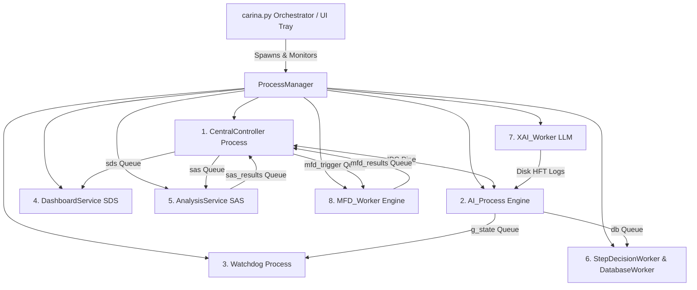

# 🏛️ CARINA: System Blueprint & Multiprocessing Architecture

This document specifies the internal engineering architecture of the CARINA ecosystem. It details the 8 concurrent operating system microservices, the deep neural network topology, the `TopologicalScaler`, the `ConsultantAgent`, the `CrossAttentionFusion` duality, physical controller drivers, and the asynchronous PostgreSQL delta storage engine.

⬅️ Back to [Main Documentation Hub](docs/CARINA_MOC.md) | 🚦 See [Hardware Drivers](docs/HARDWARE_DRIVERS.md) | 🧠 See [Neural Formulations](docs/RESEARCH_NOTES.md) | 🛡️ See [Safety & Watchdog](docs/SAFETY_AND_WATCHDOG.md)

---

## 1. Multiprocessing Microservices Concurrency Model

Python's Global Interpreter Lock (GIL) prevents multi-threaded CPU-bound AI inference and heavy I/O operations from running in true parallelism. To achieve sub-millisecond actuation latency, CARINA employs a **multiprocessing microservice model** orchestrated by [`carina.py`](file:///home/gabriel-moraes/Documentos/CARINA_CORE/carina.py) and [`src/launcher/process_manager.py`](file:///home/gabriel-moraes/Documentos/CARINA_CORE/src/launcher/process_manager.py).



---

## 2. Advanced Deep Learning Architecture

```text
    ┌─────────────────────────────────────────────────────────────────────────┐
    │                        TOPOLOGICAL SCALER (O(1))                        │
    │   Auto-detects Map Nodes (N) -> Latent Dim (32/64/128/256), Heads (2/4/8/16)│
    └────────────────────────────────────┬────────────────────────────────────┘
                                         │
    ┌─────────────────────────┐   ┌──────┴──────────────────┐   ┌───────────────────────────┐
    │     LOCAL AGENT TCN     │   │   ST-GATv2 LITE GRAPH   │   │   GLOBAL CONSULTANT PAE   │
    │ (Edge AI Real-Time 0.5ms)│   │ (Green Wave Coordinator)│   │ (Background Predictive 128ch)│
    └────────────┬────────────┘   └────────────┬────────────┘   └─────────────┬─────────────┘
                 │                             │                              │
                 └──────────────────────┬──────┴──────────────────────────────┘
                                        │
                         ┌──────────────┴──────────────┐
                         │   CROSS-ATTENTION FUSION    │
                         │ Dual Mode:                  │
                         │ - LocalAgent: Adaptive PBT  │
                         │ - Guardian: Fixed Weights   │
                         └──────────────┬──────────────┘
                                        │
                         ┌──────────────┴──────────────┐
                         │  UNIVERSAL AMP & TENSORCORE │
                         │ (torch.amp.autocast FP16)   │
                         └─────────────────────────────┘
```

### 2.1 ST-GATv2 Lite Module (`src/models/st_gatv2_lite.py`)
- **Purpose:** Spatial synchronization of arterial "Green Waves" across neighboring intersections in the urban road network graph.
- **Dynamic Weighting:** While the physical road topology is static, dynamic spatial attention coefficients $\alpha_{ij}(t)$ are recomputed in real time based on incoming vehicle densities and velocity gradients.

### 2.2 Global Consultant Agent (`src/agents/consultant_agent.py`)
- **Purpose:** Operating as a background microservice triggered by telemetry events, the Consultant projects future network states ($t + \Delta t$) using a high-capacity Predictive Autoencoder (PAE with 64 to 128 channels).
- **Targeted Mentorship:** Generates individualized predictive latent vectors $Z$ per event to enrich the contextual decision space of local PPO agents.

### 2.3 $O(1)$ Topological Auto-Scaler (`src/utils/topo_scaler.py`)
- **Algorithmic Scaling:** Auto-detects network density ($N$ intersections) and autonomously adjusts neural dimensions in powers of 2 optimized for NVIDIA TensorCores:
  - $N \le 20 \implies \text{dim} = 32, \text{heads} = 2$
  - $20 < N \le 80 \implies \text{dim} = 64, \text{heads} = 4$
  - $80 < N \le 250 \implies \text{dim} = 128, \text{heads} = 8$ (e.g., Londrina Metropolitan Grid)
  - $N > 250 \implies \text{dim} = 256, \text{heads} = 16$ (Megalopolis Grid)

### 2.4 Cross-Attention Duality (`src/models/cross_attention.py`)
- **`LocalAgent` (PPO-TCN):** Operates cross-attention with **Population-Based Training (PBT)**, dynamically adapting Softmax temperature ($\tau$) during online execution.
- **`GuardianAgent` (D3QN):** Enforces cross-attention with **Fixed Deterministic Weights** (`is_fixed=True`) to maintain an invariant, unyielding safety baseline.

### 2.5 Universal AMP & TensorCore Acceleration
- All neural network forward passes are enveloped in `torch.amp.autocast`, enabling native FP16/TF32 hardware acceleration across NVIDIA TensorCores and restricting total VRAM consumption to only **~20 MB** for the core models.

---

## 3. Persistent Data & Delta Storage Engine

CARINA implements an asynchronous persistence engine featuring **Run-Length Delta Compression** in PostgreSQL:
- **`step_decisions`**: Stores suggestions, Guardian safety vetoes, and step timers dispatched via [`StepDecisionWorker`](file:///home/gabriel-moraes/Documentos/CARINA_CORE/src/database/step_decision_worker.py) in non-blocking RAM queues ($< 0.001\text{ ms}$ overhead).
- **`edge_dictionary`**: Maps long road names to 4-byte integers for compact indexing.
- **Storage Reduction:** Achieves a **97.9% storage footprint reduction** (~380 MB/day for a 200-intersection metropolitan network).

For database schemas and query details, see [Database Architecture & Schemas](docs/DATABASE_AND_SCHEMAS.md).
