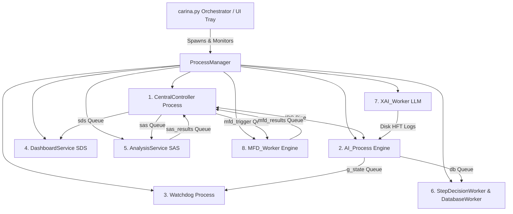

# 🏛️ CARINA: System Blueprint & Multiprocessing Architecture

This document specifies the internal engineering architecture of the CARINA ecosystem. It details the 8 concurrent operating system microservices, the deep neural network topology, the `TopologicalScaler`, the `ConsultantAgent`, the `CrossAttentionFusion` duality, physical controller drivers, and the asynchronous PostgreSQL delta storage engine.

⬅️ Back to [Main Documentation Hub](../CARINA_MOC.md) | 🚦 See [Hardware Drivers](hardware_drivers.md) | 🧠 See [Neural Formulations](../RESEARCH_NOTES.md) | 🛡️ See [Safety & Watchdog](safety_and_watchdog.md)

---

## 1. Multiprocessing Microservices Concurrency Model

Python's Global Interpreter Lock (GIL) prevents multi-threaded CPU-bound AI inference and heavy I/O operations from running in true parallelism. To achieve sub-millisecond actuation latency, CARINA employs a **multiprocessing microservice model** orchestrated by [`carina.py`](../../carina.py) and [`src/launcher/process_manager.py`](../../src/launcher/process_manager.py).



---

## 2. Advanced Deep Learning Architecture

```text
    ┌─────────────────────────────────────────────────────────────────────────┐
    │                        TOPOLOGICAL SCALER (O(1))                        │
    │   Auto-detects Map Nodes (N) -> Latent Dim (32/64/128/256), Heads (2/4/8/16)│
    └────────────────────────────────────┬────────────────────────────────────┘
                                         │
    ┌─────────────────────────┐   ┌──────┴──────────────────┐   ┌───────────────────────────┐
    │     LOCAL AGENT TCN     │   │   ST-GATv2 LITE GRAPH   │   │   GLOBAL CONSULTANT PAE   │
    │ (Edge AI Real-Time 0.5ms)│   │ (Green Wave Coordinator)│   │ (Background Predictive 128ch)│
    └────────────┬────────────┘   └────────────┬────────────┘   └─────────────┬─────────────┘
                 │                             │                              │
                 └──────────────────────┬──────┴──────────────────────────────┘
                                        │
                         ┌──────────────┴──────────────┐
                         │   CROSS-ATTENTION FUSION    │
                         │ Dual Mode:                  │
                         │ - LocalAgent: Adaptive PBT  │
                         │ - Guardian: Fixed Weights   │
                         └──────────────┬──────────────┘
                                        │
                         ┌──────────────┴──────────────┐
                         │  UNIVERSAL AMP & TENSORCORE │
                         │ (torch.amp.autocast FP16)   │
                         └─────────────────────────────┘
```

### 2.1 ST-GATv2 Lite Module (`src/models/st_gatv2_lite.py`)
- **Purpose:** Spatial synchronization of arterial "Green Waves" across neighboring intersections in the urban road network graph.
- **Dynamic Weighting:** While the physical road topology is static, dynamic spatial attention coefficients $\alpha_{ij}(t)$ are recomputed in real time based on incoming vehicle densities and velocity gradients.

### 2.2 Global Consultant Agent (`src/agents/consultant_agent.py`)
- **Purpose:** Operating as a background microservice triggered by telemetry events, the Consultant projects future network states ($t + \Delta t$) using a high-capacity Predictive Autoencoder (PAE with 64 to 128 channels).
- **Targeted Mentorship:** Generates individualized predictive latent vectors $Z$ per event to enrich the contextual decision space of local PPO agents.

### 2.3 $O(1)$ Topological Auto-Scaler (`src/utils/topo_scaler.py`)
- **Algorithmic Scaling:** Auto-detects network density ($N$ intersections) and autonomously adjusts neural dimensions in powers of 2 optimized for NVIDIA TensorCores:
  - $N \le 20 \implies \text{dim} = 32, \text{heads} = 2$
  - $20 < N \le 80 \implies \text{dim} = 64, \text{heads} = 4$
  - $80 < N \le 250 \implies \text{dim} = 128, \text{heads} = 8$ (e.g., Londrina Metropolitan Grid)
  - $N > 250 \implies \text{dim} = 256, \text{heads} = 16$ (Megalopolis Grid)

### 2.4 Cross-Attention Duality (`src/models/cross_attention.py`)
- **`LocalAgent` (PPO-TCN):** Operates cross-attention with **Population-Based Training (PBT)**, dynamically adapting Softmax temperature ($\tau$) during online execution.
- **`GuardianAgent` (D3QN):** Enforces cross-attention with **Fixed Deterministic Weights** (`is_fixed=True`) to maintain an invariant, unyielding safety baseline.

### 2.5 Universal AMP & TensorCore Acceleration
- All neural network forward passes are enveloped in `torch.amp.autocast`, enabling native FP16/TF32 hardware acceleration across NVIDIA TensorCores and restricting total VRAM consumption to only **~20 MB** for the core models.

---

## 3. Persistent Data & Delta Storage Engine

CARINA implements an asynchronous persistence engine featuring **Run-Length Delta Compression** in PostgreSQL:
- **`step_decisions`**: Stores suggestions, Guardian safety vetoes, and step timers dispatched via [`StepDecisionWorker`](../../src/database/step_decision_worker.py) in non-blocking RAM queues ($< 0.001\text{ ms}$ overhead).
- **`edge_dictionary`**: Maps long road names to 4-byte integers for compact indexing.
- **Storage Reduction:** Achieves a **97.9% storage footprint reduction** (~380 MB/day for a 200-intersection metropolitan network).

For database schemas and query details, see [Database Architecture & Schemas](database_and_schemas.md).

---

## 4. Modular Settings Architecture (`src/settings/`)

To adhere to the **Single Responsibility** and **Interface Segregation** principles (SOLID), CARINA's configuration management is decomposed into decoupled, testable components:

```text
       ┌────────────────────────────────────────────────────────┐
       │               SettingsService (Orchestrator)           │
       └───────────┬────────────────────────────────┬───────────┘
                   │                                │
        ┌──────────┴──────────┐          ┌──────────┴──────────┐
        ▼                     ▼          ▼                     ▼
┌───────────────┐     ┌──────────────┐ ┌────────────────┐ ┌──────────────────────┐
│SettingsSchema │     │ISettingsRead │ │IniFileStorage  │ │DotenvSecretProvider  │
│(Validation &  │     │& Write       │ │(settings.ini   │ │(.env 12-Factor App   │
│ Section Map)  │     │(Interfaces)  │ │ File I/O)      │ │ Environment Secrets) │
└───────────────┘     └──────────────┘ └────────────────┘ └──────────────────────┘
                   ▲
                   │ Backwards Compatibility Facade
        ┌──────────┴──────────┐
        │   SettingsManager   │ (src/utils/settings_manager.py)
        └─────────────────────┘
```

- **`SettingsSchema` (`src/settings/schema.py`):** Authoritative registry defining key-to-section mappings, default fallback values, and type validation rules.
- **`IniFileStorage` (`src/settings/ini_storage.py`):** Handles file reading and persistent writing to `config/settings.ini`.
- **`DotenvSecretProvider` (`src/settings/env_provider.py`):** Resolves sensitive infrastructure secrets from `.env` using `python-dotenv` with fallback file parsing.
- **`SettingsService` (`src/settings/service.py`):** Core service orchestrating configuration retrieval, validation, and serialization.
- **`SettingsManager` (`src/utils/settings_manager.py`):** Drop-in backwards compatibility facade guaranteeing zero regressions for legacy callers.

---

## 5. Polymorphic Monitoring & Transport Architecture (`src/transports/`)

CARINA features a **polymorphic telemetry and incident transport layer** enabling real-time remote monitoring over local MQTT brokers, remote webhooks, Cloud REST APIs, or tunneling solutions (e.g., Ngrok):

```text
IncidentReporter / TelemetryLoop
            │
            ▼
┌───────────────────────┐
│     MonitorClient     │ (Singleton Facade)
└───────────┬───────────┘
            │
            ▼
┌───────────────────────┐
│create_monitor_transport│ (Factory with Automatic Endpoint Resolution)
└───────────┬───────────┘
            ├──────────────────────────────────────────┐
            ▼                                          ▼
┌───────────────────────────┐             ┌───────────────────────────┐
│   MonitorMqttTransport    │             │   MonitorHttpTransport    │
│  (Local / Network Broker) │             │(REST API / Cloud / Ngrok) │
│ - Host:Port (e.g. :1883)  │             │ - http:// or https://     │
│ - QoS 0/1 Telemetry       │             │ - Persistent HTTP Session │
│ - Topics: noxfort/telem/  │             │ - Exponential backoff retry│
└───────────────────────────┘             └───────────────────────────┘
```

### 5.1 Transport Abstraction (`BaseMonitorTransport`)
Defines the strict contract for all external telemetry exporters:
- `setup()`: Configures endpoints, timeouts, and credentials.
- `ensure_connected()`: Establishes or validates connectivity.
- `publish(topic, payload)`: Transmits JSON payloads asynchronously or in dedicated worker threads.
- `disconnect()`: Flushes pending buffers and cleanly terminates sessions.

### 5.2 Automatic Endpoint Resolution (`endpoint_resolver.py`)
Intelligently classifies target endpoints without requiring explicit protocol configuration:
- URLs starting with `http://` or `https://` (or domains containing `ngrok`, `run.app`, or `/api/`) instantiate `MonitorHttpTransport`.
- Standard hostname/IP strings (`localhost`, `10.0.0.1`, `broker:1883`) instantiate `MonitorMqttTransport`.

### 5.3 Incident Deduplication & Alert Filtering (`src/drivers/`)
- [`IncidentReporter`](../../src/drivers/incident_reporter.py) broadcasts hardware connection state changes and controller errors to external monitoring tools.
- [`IncidentFilter`](../../src/drivers/incident_filter.py) suppresses alert floods by caching active incident hashes with timestamp debouncing, maintaining `.carina_incident_filter_cache.json` across system lifecycles.

---

## 6. High-Performance Field Hardware Gateway (`src_go/`)

To achieve industrial-grade reliability, sub-millisecond network determinism, and zero GIL contention in field deployments, CARINA offloads all real-world traffic signal controller communication (UDP ports 161 and 162) to a dedicated, compiled **Go Hardware Gateway** (`bin/carina-go` built from `src_go/`):

```text
       ┌────────────────────────────────────────────────────────┐
       │                      CARINA CORE                       │
       │                                                        │
       │   [Synapse Perception]  <-- gRPC (50051) -->  [Camera] │
       │            │                                           │
       │      [AI Engine / NN]                                  │
       │            │                                           │
       │     [ActionSupervisor]                                 │
       │            │                                           │
       │ [HardwareConnectionManager] (Python Orchestrator)      │
       │            │                                           │
       │    [GoGatewayClient] (Pipe Subprocess Manager)         │
       └────────────┬───────────────────────────────────────────┘
                    │ stdin / stdout (Line-Delimited JSON)
                    │ ZERO OPEN NETWORK PORTS ON HOST
                    ▼
       ┌────────────────────────────────────────────────────────┐
       │          CARINA HARDWARE GATEWAY (Go Daemon)           │
       │                    (bin/carina-go)                     │
       │                                                        │
       │  +-- [NDJSON IPC Scanner & Concurrent Writer]          │
       │  +-- [HardwareManager Connection Registry]             │
       │  +-- [Atomic Fail-Safe on EOF / SIGPIPE]               │
       │  +-- [Heartbeat Engine: time.Ticker per intersection]  │
       │  +-- [NTCIP 1202 & UTMC2 Protocol Dispatchers]         │
       │  +-- [GoSNMP Client Pool (UDP 161)]                    │
       │  +-- [TrapListener Server (UDP 162)]                   │
       └────────────────────┬──────────────────┬────────────────┘
                            │ UDP 161          │ UDP 162 (Traps)
                            ▼                  ▼
                    [Field Controller]   [Field Controller] ...
```

### 6.1 Key Architectural Properties
- **Zero Host Ports Opened:** The control link between Python and Go runs exclusively over standard anonymous pipes (`pipe(2)` kernel ring buffers). No localhost ports, sockets, or HTTP services are exposed.
- **Atomic Safety Fail-Safe:** If the Python AI process crashes or closes, the kernel closes the pipe. The Go binary detects `EOF` on `os.Stdin` in microseconds and immediately triggers `EmergencyReleaseControlAll()` via SNMP, safely releasing remote holds and returning controllers to their local autonomous plans.
- **Zero GIL Contention:** Goroutines handle concurrent polling, 2.0s keepalive heartbeats, and UDP 162 trap reception independently of Python's heavy PyTorch tensor operations.
- **Seamless Adapter (`GoTrafficDriverProxy`):** Adheres to the Liskov Substitution Principle (LSP) by implementing `BaseTrafficDriver`, making the Go gateway 100% transparent to the rest of the CARINA codebase.

---

## 7. F.E.N.I.X. Process Supervisor & Crash Recovery Subsystem (`src/fenix/`)

CARINA incorporates **F.E.N.I.X.** (Fault-tolerant Engine for Networked Intelligent eXecution) to guarantee 24/7 continuous autonomous self-healing for the AI inference engine:

```text
       ┌────────────────────────────────────────────────────────┐
       │                 Watchdog Health Monitor                │
       └───────────────────────────┬────────────────────────────┘
                                   │ Timeout / Missed Heartbeat
                                   ▼
       ┌────────────────────────────────────────────────────────┐
       │            FenixSupervisor (Orchestrator)              │
       └──────────────┬───────────────────────────┬─────────────┘
                      │                           │
                      ▼                           ▼
       ┌────────────────────────────┐ ┌─────────────────────────┐
       │WindowedCrashRecoveryPolicy │ │    SubprocessRunner     │
       │- Sliding window backoff    │ │- Subprocess lifecycle   │
       │- Max restarts quota limiter│ │- SIGTERM / SIGKILL      │
       └────────────────────────────┘ └───────────┬─────────────┘
                                                  │ Respawn
                                                  ▼
                                      ┌─────────────────────────┐
                                      │     StateReconciler     │
                                      │- FROZEN_SYNC telemetry  │
                                      │- Boundary Handshake     │
                                      │- Zero-collision handover│
                                      └─────────────────────────┘
```

- **`FenixSupervisor` (`src/fenix/fenix_supervisor.py`):** Coordinates subprocess termination, recovery backoff, child resurrection, and state reconciliation.
- **`WindowedCrashRecoveryPolicy` (`src/fenix/recovery_policy.py`):** Computes exponential backoffs and enforces restart rate limits to prevent cascading restart storms.
- **`SubprocessRunner` (`src/fenix/process_runner.py`):** Low-level subprocess management ensuring deterministic process isolation and clean SIGTERM/SIGKILL termination.
- **`StateReconciler` (`src/fenix/state_reconciler.py`):** Ensures the resurrected AI engine operates in `FROZEN_SYNC` mode and only assumes actuation control at clean phase boundaries when physical controllers transition stages naturally.
