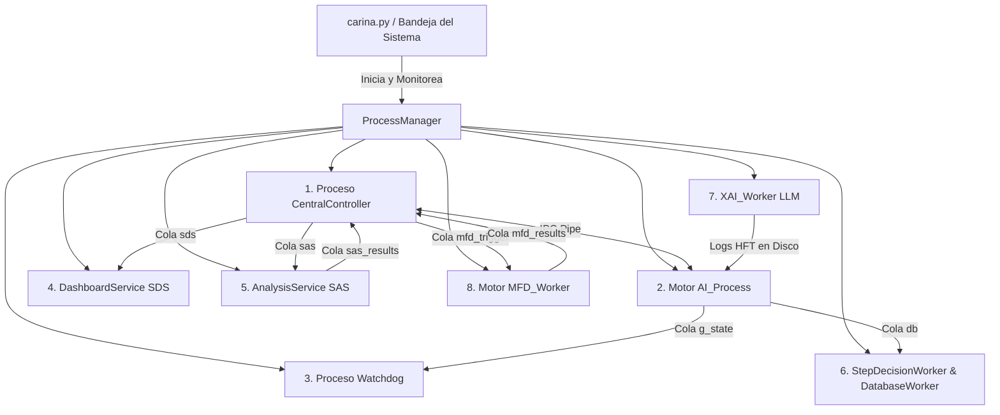

# 🏛️ CARINA: Arquitectura del Sistema y Multiprocesamiento

Este documento especifica la arquitectura interna del ecosistema CARINA: los 8 microservicios concurrentes en procesos del sistema operativo, la topología de red neuronal profunda, el `TopologicalScaler`, el `ConsultantAgent`, la dualidad de atención cruzada (`CrossAttentionFusion`), los controladores de hardware físico y el motor asíncrono de almacenamiento delta en PostgreSQL.

⬅️ [Centro de Documentación](../README.md) | 🚦 [Controladores de Hardware](hardware_drivers.md) | 🛡️ [Seguridad y Watchdog](safety_and_watchdog.md) | 🧪 [Pruebas](testing.md)

---

## 1. Concurrencia mediante Microservicios Multiproceso

El Global Interpreter Lock (GIL) de Python impide el paralelismo real multihilo para cargas pesadas de IA y operaciones de red. Para lograr latencias de actuación de sub-milisegundo, CARINA implementa un **modelo de microservicios multiproceso** orquestado por `carina.py` y `src/launcher/process_manager.py`.

---

## 2. Topología de Deep Learning e Inferencia

- **Capa Táctica (PPO-TCN):** Control local de fases en tiempo real (< 0.5 ms).
- **Capa Estratégica (ST-GATv2 Lite):** Coordinación dinámica de Ondas Verdes mediante atención espacio-temporal en grafos arteriales.
- **Capa de Consultoría Global (PAE 128 canales):** Autoencoder Predictivo en background que proyecta estados de congestión futuros ($t + \Delta t$).
- **Topological Scaler $O(1)$:** Auto-escala las dimensiones latentes (32, 64, 128, 256) y cabezas de atención según el número de nodos urbanos $N$.
- **Aceleración Universal AMP:** Toda la inferencia utiliza `torch.amp.autocast` en FP16 sobre TensorCores de NVIDIA, restringiendo la memoria VRAM a sólo ~20 MB.

---

## 3. Almacenamiento Delta Asíncrono en PostgreSQL
Utiliza compresión Run-Length Encoding en tablas como `step_decisions` y `synapse_fluid_dynamics`, logrando una **reducción del 97.9% en el espacio de base de datos** (~380 MB/día para redes de 200 intersecciones).

---

## 4. Gateway de Hardware en Go (`bin/carina-go`)
Comunicación directa con controladores físicos en la calle mediante pipes anónimos del sistema operativo (`stdin`/`stdout`) con formato NDJSON, garantizando **cero puertos de red abiertos en el host** y fail-safe atómico inmediato en caso de desconexión.

---

## 5. Auto-Recuperación con F.E.N.I.X. (`src/fenix/`)
Supervisa el proceso de IA con políticas de backoff exponencial ante caídas, operando en modo `FROZEN_SYNC` y sincronizando el traspaso de mando únicamente en fronteras limpias de fase para evitar conflictos viales.
