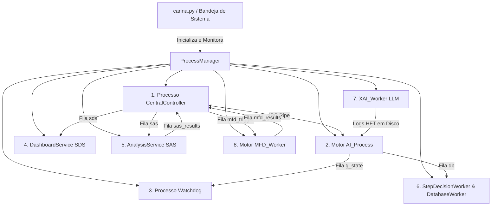

# 🏛️ CARINA: Blueprint do Sistema e Arquitetura de Multiprocessamento

Este documento especifica a arquitetura interna do ecossistema CARINA. Ele detalha os 8 microsserviços concorrentes em processos do sistema operacional, a topologia de rede neural profunda, o `TopologicalScaler`, o `ConsultantAgent`, a dualidade de atenção cruzada (`CrossAttentionFusion`), os drivers de controladores físicos e o motor assíncrono de persistência com compressão delta no PostgreSQL.

⬅️ [Central de Documentação](../README.md) | 🚦 [Controladores de Hardware](hardware_drivers.md) | 🛡️ [Segurança e Watchdog](safety_and_watchdog.md) | 🧪 [Testes e Validação](testing.md)

---

## 1. Modelo de Concorrência de Microsserviços Multiprocesso

O Global Interpreter Lock (GIL) do Python impede inferência de IA e operações pesadas de I/O em verdadeiro paralelismo multithread. Para garantir latência de atuação em sub-milissegundos, o CARINA implementa um **modelo de microsserviços multiprocesso** orquestrado por `carina.py` e `src/launcher/process_manager.py`.



---

## 2. Arquitetura Avançada de Deep Learning

```text
    ┌─────────────────────────────────────────────────────────────────────────┐
    │                        TOPOLOGICAL SCALER (O(1))                        │
    │   Detecta Nós do Mapa (N) -> Dimensão Latente (32/64/128/256), Heads    │
    └────────────────────────────────────┬────────────────────────────────────┘
                                         │
    ┌─────────────────────────┐   ┌──────┴──────────────────┐   ┌───────────────────────────┐
    │     LOCAL AGENT TCN     │   │   ST-GATv2 LITE GRAPH   │   │   GLOBAL CONSULTANT PAE   │
    │ (Edge AI Real-Time 0.5ms)│   │ (Coordenador Onda Verde)│   │ (Preditivo Fundo 128 can.)│
    └────────────┬────────────┘   └────────────┬────────────┘   └─────────────┬─────────────┘
                 │                             │                              │
                 └──────────────────────┬──────┴──────────────────────────────┘
                                        │
                         ┌──────────────┴──────────────┐
                         │    CROSS-ATTENTION FUSION   │
                         │ Modo Duplo:                 │
                         │ - LocalAgent: PBT Adaptativo│
                         │ - Guardian: Pesos Fixos     │
                         └──────────────┬──────────────┘
                                        │
                         ┌──────────────┴──────────────┐
                         │  UNIVERSAL AMP & TENSORCORE │
                         │ (torch.amp.autocast FP16)   │
                         └─────────────────────────────┘
```

### 2.1 Módulo ST-GATv2 Lite (`src/models/st_gatv2_lite.py`)
- **Propósito:** Sincronização espacial de "Ondas Verdes" arteriais entre cruzamentos vizinhos no grafo viário urbano.
- **Ponderação Dinâmica:** Embora a topologia física seja estática, os coeficientes dinâmicos de atenção espacial $\alpha_{ij}(t)$ são recalculados em tempo real com base nas densidades de veículos e gradientes de velocidade.

### 2.2 Agente Consultor Global (`src/agents/consultant_agent.py`)
- **Propósito:** Operando como microsserviço de background disparado por eventos de telemetria, projeta estados de tráfego futuros ($t + \Delta t$) via Autoencoder Preditivo de alta capacidade (PAE com 64 a 128 canais).
- **Mentoria Direcionada:** Produz vetores latentes preditivos $Z$ individuais por evento para enriquecer o espaço de decisão dos agentes locais PPO.

### 2.3 Auto-Escalonador Topológico $O(1)$ (`src/utils/topo_scaler.py`)
- Ajusta dinamicamente a dimensão oculta e o número de cabeças de atenção conforme o número de interseções $N$:
  - $N \le 20 \implies \text{dim} = 32, \text{heads} = 2$
  - $20 < N \le 80 \implies \text{dim} = 64, \text{heads} = 4$
  - $80 < N \le 250 \implies \text{dim} = 128, \text{heads} = 8$ (ex: Malha Metropolitana de Londrina)
  - $N > 250 \implies \text{dim} = 256, \text{heads} = 16$ (Grandes Megalópoles)

### 2.4 Dualidade de Atenção Cruzada (`src/models/cross_attention.py`)
- **`LocalAgent` (PPO-TCN):** Opera com **Treinamento Baseado em População (PBT)**, ajustando a temperatura Softmax ($\tau$) durante a execução.
- **`GuardianAgent` (D3QN):** Opera com **Pesos Determinísticos Fixos** (`is_fixed=True`) para manter uma linha de base de segurança invariável.

---

## 3. Armazenamento Delta Assíncrono no PostgreSQL

O CARINA utiliza **Compressão Delta por Run-Length Encoding** no PostgreSQL:
- **`step_decisions`**: Registra sugestões, vetos de segurança e cronômetros via `StepDecisionWorker` em filas de RAM não-bloqueantes (< 0,001 ms).
- **`edge_dictionary`**: Mapeia identificadores de vias para inteiros compactos de 4 bytes.
- **Redução de Espaço:** Redução global de **97,9% no volume de armazenamento** (~380 MB/dia para 200 cruzamentos).

---

## 4. Arquitetura Modular de Configurações (`src/settings/`)

Em conformidade com os princípios SOLID, o gerenciamento de configurações é estruturado em:
- **`SettingsSchema` (`src/settings/schema.py`):** Validação e mapeamento de chaves para seções.
- **`IniFileStorage` (`src/settings/ini_storage.py`):** I/O e persistência no arquivo `config/settings.ini`.
- **`DotenvSecretProvider` (`src/settings/env_provider.py`):** Resolução de segredos de infraestrutura no `.env` (12-Factor App).
- **`SettingsService` (`src/settings/service.py`):** Serviço orquestrador desacoplado.
- **`SettingsManager` (`src/utils/settings_manager.py`):** Fachada de compatibilidade retroativa para código legado.

---

## 5. Arquitetura Polimórfica de Monitoramento (`src/transports/`)

A camada de telemetria externa suporta tanto corretores MQTT locais quanto endpoints HTTP/REST em nuvem (ex: túneis Ngrok, Webhooks):
- **`endpoint_resolver.py`:** Detecta automaticamente a estratégia correta com base no formato do host/URL.
- **`IncidentReporter` e `IncidentFilter`:** Despacham alertas com debounce e supressão de enxames de notificações gravando estado em `.carina_incident_filter_cache.json`.

---

## 6. Gateway de Hardware Industrial em Go (`src_go/`)

Todo o tráfego com controladores reais de rua (portas UDP 161 e 162) é transferido para o binário nativo compuilado **`bin/carina-go`**:
- **Zero Portas Abertas no Host:** A comunicação entre Python e Go roda exclusivamente através de pipes anônimos do sistema operacional (`stdin`/`stdout`) via NDJSON.
- **Fail-Safe Atômico:** Caso o processo Python aborte, o kernel fecha o pipe (`EOF`/`SIGPIPE`). O binário em Go detecta em microssegundos e aciona liberação de emergência via SNMP, devolvendo os controladores para seus planos locais fixos.
- **Zero Contenção de GIL:** Goroutines executam heartbeats de 2,0s e escuta de traps de forma independente.

---

## 7. Subsistema de Auto-Cura F.E.N.I.X. (`src/fenix/`)

O CARINA integra o subsistema **F.E.N.I.X.** para garantir resiliência 24/7 contínua com auto-ressurreição de processos:
- **`FenixSupervisor`:** Fachada de orquestração ativada pelo Watchdog (`on_fenix_trigger`).
- **`WindowedCrashRecoveryPolicy`:** Política de backoff exponencial e limite de reinícios por janela de tempo.
- **`SubprocessRunner`:** Controle determinístico do ciclo de vida dos processos-filhos (SIGTERM com fallback SIGKILL).
- **`StateReconciler`:** Sincronização em modo `FROZEN_SYNC` que só devolve a atuação de IA em fronteiras limpas de estágio, garantindo transição 100% segura sem saltos de fase.
